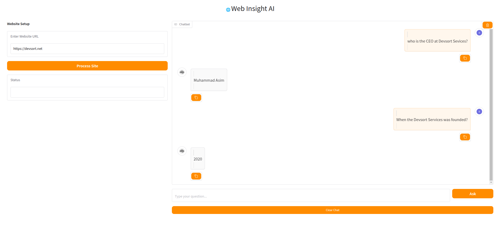

# Website QA Chatbot with RAG

A powerful chatbot that answers questions about website content using Retrieval-Augmented Generation (RAG) and LangChain, featuring a DeepSeek-like chat interface.

## Features
- **Website Content Extraction**: Crawls and indexes website content
- **Conversational AI**: GPT-4 powered Q&A with chat history
- **Vector Search**: ChromaDB with OpenAI embeddings
- **Modern Interface**: Chat-style UI with avatars and typing effects
- **Session Management**: Automatic conversation saving

## Installation
```bash
git clone https://github.com/yourusername/website-qa-chatbot.git
cd website-qa-chatbot
python -m venv venv
source venv/bin/activate  # Linux/Mac
venv\Scripts\activate     # Windows
pip install -r requirements.txt
echo "OPENAI_API_KEY=your-api-key-here" > .env
```

## Usage

```
python main.py
```
- Enter a website URL (e.g., https://example.com)

- Click "Process Website"

- Ask questions like:

- "What does this company do?"

- "Who is the CEO?"

- "When was this founded?"
